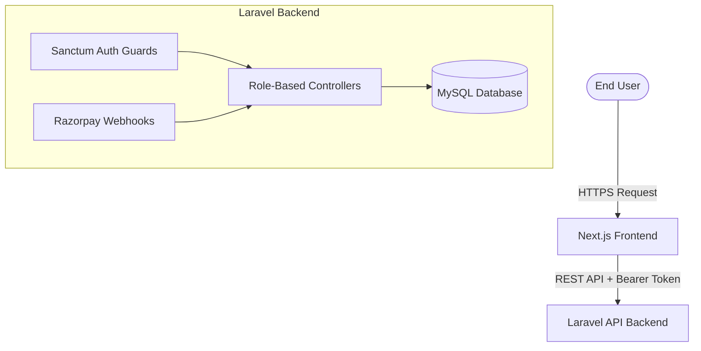

<div align="center">
  
  <h1>BlueBoxx DA - Enterprise EdTech Platform</h1>
  <p>The Learn-Work-Earn Platform connecting Students, Colleges, and Companies.</p>
</div>

---

##  Project Overview
BlueBoxx DA is a production-ready, enterprise-grade EdTech and Placement platform built with **Next.js 14** and **Laravel 12**. 
It orchestrates a complex multi-sided marketplace handling Course enrollments, Job & Internship applications, Mentor bookings, and automated B2B Campus Placements.

##  Features
- **Multi-Role Sanctum Auth:** 7 strictly isolated portals (Admin, Student, Intern, Job Seeker, Expert, Company, College).
- **Payment Gateway Integration:** Razorpay integration wrapped in ACID-compliant Database Transactions.
- **E-Commerce Learning System:** Courses, quizzes, automated certificate generation, and dashboard tracking.
- **Career Pipeline:** Automated cascading workflows for Job & Internship applications directly to B2B Company portals.
- **Advanced SEO Engine:** Programmatic dynamic meta tags, Open Graph, Twitter Cards, and deep Schema.org JSON-LD injections.
- **High-Performance Architecture:** Rate limiting, N+1 query elimination, query caching, and React Concurrent rendering.

##  Tech Stack
- **Frontend:** Next.js 14 (Pages Router), React 18, TypeScript, Tailwind CSS, Framer Motion, Zustand.
- **Backend:** Laravel 12, PHP 8.2+, MySQL 8, Sanctum API Auth.
- **Tools:** Pest/PHPUnit, ESLint, Prettier, SWR.

##  Architecture Diagram


##  Project Structure
The repository contains the frontend application:
- `/` - Next.js Frontend application.
- `/docs` - Comprehensive Technical Documentation.

*See [`/docs/PROJECT_STRUCTURE.md`](docs/PROJECT_STRUCTURE.md) for the complete directory tree.*

##  Installation & Requirements
**Requirements:**
- Node.js >= 18.17.0
- PHP >= 8.2
- Composer
- MySQL >= 8.0

**1. Clone the repository**
```bash
git clone https://github.com/your-org/blueboxx-da.git
cd blueboxx-da
```

**2. Backend Setup**
Please refer to the separate backend repository for instructions on setting up the Laravel API.

**3. Frontend Setup**
Open a new terminal at the root directory:
```bash
npm install
npm run dev
```

##  Environment Variables
You will need to configure environment variables for both the frontend and backend. See [`/docs/ENVIRONMENT.md`](docs/ENVIRONMENT.md) for the complete required keys (Razorpay, SMTP, DB credentials).

##  Deployment Guide
The platform is optimized for VPS, Ubuntu, Nginx, or Docker deployments.
- Run `npm run build` and `npm run start` for the Next.js production server.
- Run `php artisan optimize:clear` and configure Nginx to point to `backend/public`.
- See the complete [Deployment Guide](docs/DEPLOYMENT.md).

##  Technical Documentation
For deep technical integrations, refer to the `/docs` directory:
- [System Architecture](docs/ARCHITECTURE.md)
- [Database Schema & Integrity](docs/DATABASE.md)
- [API Reference](docs/API.md)
- [Security Matrix](docs/SECURITY.md)

## 🤝 Contributing & Support
Please read [`docs/CONTRIBUTING.md`](docs/CONTRIBUTING.md) for details on our code of conduct, branching strategy, and the process for submitting Pull Requests.

---
**License:** MIT License. See [LICENSE](LICENSE) for details.
